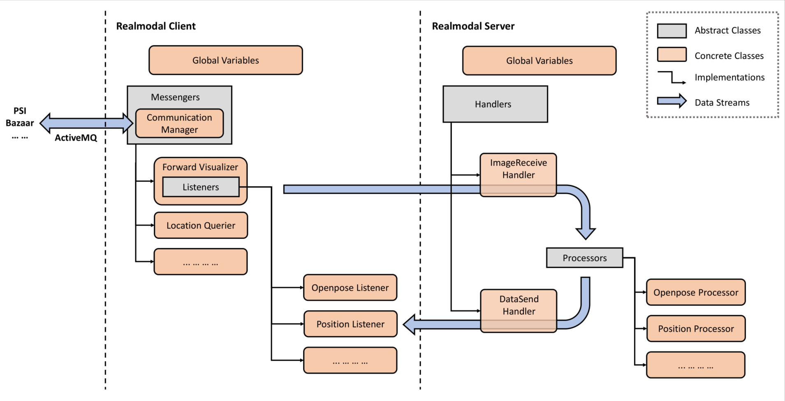

# Realmodal Document
This is a document that has everything you need to know if you want to make modifications.

- [Realmodal Document](#realmodal-document)
  * [Requirements and Quick Start](#requirements-and-quick-start)
  * [Realmodal Architecture](#realmodal-architecture)
    + [Realmodal Client](#realmodal-client)
      - [Messenger](#messenger)
      - [ForwardVisualizer](#forwardvisualizer)
    + [Realmodal Server](#realmodal-server)
      - [Processors](#processors)
  * [Adding New Components](#adding-new-components)
    + [GlobalVariables](#globalvariables)
  * [Configuration Details](#configuration-details)
    + [Overview](#overview)
    + [Meta-Information](#meta-information)
    + [Address](#address)
    + [Components](#components)
      - [Common Properties](#common-properties)
      - [Component-specific Properties](#component-specific-properties)
        * [Position](#position)
    + [Messengers (Client)](#messengers--client-)
      - [Forward Visualizer](#forward-visualizer)
      - [Location Querier](#location-querier)
      - [Dialog Messenger](#dialog-messenger)
    + [Handlers (Server)](#handlers--server-)
    + [Cameras](#cameras)

## Requirements and Quick Start
Refer to [readme.md](../readme.md). 
## Realmodal Architecture

The figure shows the conceptual architecture of Realmodal. Generally speaking, Realmodal consists of two parts, 
**Realmodal Client** and **Realmodal Server**. 
### Realmodal Client
Realmodal Client is the part running on the local machine. It's designed to communicate directly with other modules via
ActiveMQ, and forward the messages to the server for further processing. 

#### Messenger
Messengers are the core parts of the Client. As the name illustrates, a messenger will carry data coming from ActiveMQ
and send them to the server. During running, a client can create several messengers to process different kinds of data
separately.

Messengers use **CommunicationManager** to communicating with other modules via ActiveMQ. When the client begins to run,
an overall CommunicationManager is created and stored in `self.cm` for every messenger. A messenger can use the method 
`subscribe_to` to subscribe to topics. Afterward, when new data under the topic come in, the method `on_message` will
be called. If you want to send messages to other modules, you can use the `send` method. 

At the beginning of the client, the `start` method will be called. You can define some events here but it's optional.   

The messenger is designed to forward messages from other modules to the server. However, a messenger can be manually
designed for more functions. For example, it can be designed to visualize the incoming data and processing results, or
do simple processing work without sending the data to the server.

#### ForwardVisualizer
There is a special predefined messenger named ForwardVisualizer. As the name indicates, this messenger *forwards* data
to the server while *visualize* the data and the result on the local machine. Currently, only image data are forwarded
by this messenger.

In order to receive results from different processors which may have different meanings and formats, **listeners** are
attached to the ForwardVisualizer. ForwardVisualizer, listeners, and processors which will be mentioned in the server
section use TCP sockets to communicate with each other. Some methods are implemented for easier use. Every listener 
should implement two methods:
* `receive(socket)`: the method to receive results from the server via socket. The return value of this method should be
a buffer containing the necessary information used to draw the results on the canvas.
* `draw(img, buf)`: draw the results stored in the buffer on the image.  

### Realmodal Server
Realmodal Server is the part running on the server for heavy computations. When running, the server maintains two handlers: one is for receiving messages from the Client, and the other is for sending back processed results. Current
handlers are only designed for image data but you can design new handlers based on specific needs. Of course, you may
need new messengers and listeners on the Client end as well.

#### Processors
Processors are individual units running on Realmodal Server, waiting for incoming messages. They're initialized when the
Server starts to run, and are called by the handler when new messages are flowing in. Every processor should implement 
the following methods:
* `initialize(config)`: (optional) this is a class method. It defines the behavior of how the processor should do as 
initialization.
* `process(info)`: the core method to process messages stored in info. 
* `send(soc)`: send the processed information back to the Realmodal Client. The number and the type of messages sent
through this socket should match the definitions in the corresponding listener.         

## Adding New Components
It's quite simple to add new components to Realmodal and you don't need to bother understanding and changing the pipeline.
Generally speaking, when you need some new functions in your projects, follow these steps:
* Decide what part you need to add. If you still only need the image information, you may only need a pair of listener
and processor. If you need a type of message involved in the pipeline, you may need a new messenger. And further, if you
need this new type of information to be processed on the server, you may also need a new handler.
* Create a new class derived from the corresponding base class and implement the details. For example, if you're 
implementing a new listener, you can create a new class derived from `BaseRemoteListener` and implement `receive()` and
`draw()`.      
* Register it to the GlobalVariables for easy fetch by a configuration file. 
* Add the new part to the configuration file.
And you are all set! Now you can run the pipeline and test your new components. 

### GlobalVariables
The `GlobalVariables` class is a special class that stores all the global information shared by different parts of the 
system, e.g., the mapping information between names and the corresponding classes, the locks that ensure safety for 
multi-processing, and the temporary variables that may be used by another module in the future. 

There are two main usage for this class:
1. Register a class(listener, handler, etc.) with a proper name and make it configurable in the configuration file. In
order to register a class, you can simply add a corresponding class decorator to the class. 
    
   For example, this is how the OpenPose Listener is defined and uses `openpose` as its name.  
   ```python
   from common.GlobalVariables import GV
   from components.client.RemoteListener import BaseRemoteListener
   
   @GV.register_listener("openpose")
   class OpenPoseListener(BaseRemoteListener):
       def __init__(self, config):
           ...
   ```   

2. Store and pass global variables for future use. You can use `GV.register(name, value)` and `GV.get(name)` to store 
and fetch values. 

   You can also use `.` to make organized global variables. For example, running the code:
   ```python
   from common.GlobalVariables import GV
   GV.register("test.first", "first value")
   GV.register("test.second", "second value")
   print(GV.get("test"))
   ``` 
   The result will be:
   ```python
   {'first': 'first value', 'second': 'second value'}
   ```
  
## Logging 
In order to make debugging easier and monitor the status of the system, it's necessary to print logs to the console. In
this project, you can use logger instead of the "print()" method for a better debugging experience. 
### Loggers
We use the [logging](https://docs.python.org/3/library/logging.html) package in this project. In order to create a 
logger, you can simply use `get_logger` in `common.logprint` like:
```python
from common.logprint import get_logger

logger = get_logger(__name__)
logger.debug("This is a log for debugging.")
logger.info("This is a log for information.")
logger.warning("This is a log for warnings.")
logger.error("This is a log for errors.")
logger.fatal("This is a log for fatal errors, the program probably crashes")
```

The parameter passed to the `get_logger` function is the name of the logger. We recommend you to us `__name__` so when 
logs are printed, you can easily find which module gives you the information.   

### Periodic Reports
  
## Configuration Details
### Overview
Our project uses `.yaml` file to manage configurations between different settings. It is a language similar to `.json` 
but more readable for humans. One needs to learn some basic `.yaml` grammar to use this but don't worry, it's simple.

In the project, we use [OmegaConf](https://github.com/omry/omegaconf) to load the configurations from `.yaml` file. The
configuration dictionary is stored as a `DictConfig` object, and there are three ways to fetch a property from the 
dictionary. As an example, to get the `config_name` property from the primitive object, the following 3 lines are 
equivalent and will print "Sigdial 2020 - Demo" to console:
```python
print(config.config_name)
print(config["config_name"])
print(config.get("config_name"))
```
There is a small difference when using the third method. When the key is missing in the dictionary, the `get` method
will return `None` as the default value. You can also specify this default value by passing it to the method as:
```python
print(config.get("config_name", "Default Configuration"))
```

For most components of this project, configurations are passed and stored in `self.config` for later use.

### Meta-Information
* **config_name**: a string. The name of this configuration.
* **config_version**: a string. The version of this configuration.
* **logging**: a set of entries. 
  * **logging_level**: a string in `{debug, info, warning, error, fatal)`. The minimum level of logs to be printed to
  the console. 
  * **report_level**: a string in `{debug, info, warning, error, fatal)`. The minimum level of reports to be printed to
  the console.
  * **report_period**: an integer. The interval between two reports (unit: second).  

### Address
The address of the server. The server will set up services on specified ports and communicate with the client.

In order to check your ip address of the server, one can use the command:
```shell script
ifconfig -a
``` 
* **ip**: a string of the format `x.x.x.x`. The ip address of the server. Currently, only ipv4 addresses are supported.
* **port**: two integer numbers named **upstream** and **downstream**. Available ports on the server to build
communication. 

### Components
Components are those attachable modules that are used to process multimodal data sent to server. Although they could be
deployed only on one end, most components work in pair, i.e. a listener on the client and a corresponding
processor on the server. Therefore, in the configuration file, the component properties are merged into one and will be
shared by listeners and processors.
#### Common Properties
* **topic**: a string. Topic used as an identifier for the handler and the messenger to distinguish which component is
processing the data. 
* **process_interval**: a float number. Minimum intervals allowed for each component to process the incoming data. This
is designed to resolve the increasing latency issue due to the limit of network bandwidth. If the system is suffering
from this issue, try to increase this value. *(Or try to fix it using a better design of network transmission)*
* **init_param**: a dictionary. Parameters used to do the initialization. These parameters will be passed to the 
`initialize()` method of the processors.
#### Component-specific Properties
Currently, face recognition and Openpose don't require additional properties. 
##### Position
* **backend**: a string in `{openpose, face_recognition}` (case insensitive). The backend module used to calculate the
position information. Make sure the corresponding module is also activated.
* **topic_to_psi**: a string. The ActiveMQ topic used to notify other modules of the position information.
* **single_camera_distance**: a float number. The distance from the target to the camera used to calculate position when
only one camera without the depth information is used.
* **display_size**: a list containing two integers. The height and width (in pixel) of the window showing the layout of
the room and people's position.
* **display_margin**: the margin between the layout to the window's edges. 
* **room_corner**: a list containing several 3D points. Coordinates of room corners (in centimeter). Please list them 
clockwise or counterclockwise to avoid crossing lines.

### Messengers (Client)
Messengers are defined under the key `client`. Here, you can specify the messengers you are using in this project, and
customize properties for them. The client will look up every key included under it from the global variable lists,
create the corresponding messenger, and initialize it with the value as parameters.
#### Forward Visualizer
The ForwardVisualizer is built to forward the multimodal stream from other modules(PSI, etc.) via ActiveMQ to the 
server, while visualizing the results of server processors in the client end.  
* **address**: address to communicate with the server. See [Address](#address) section.
* **listeners**: components used. See [Components](#components) section.
* **topic**: a string. The topic of the ActiveMQ used for the messenger to receive image from other modules.
* **psi_image_format**: a string in `{raw, jpg}`. The format of the image received from PSI. Using the `.jpg` format can reduce
the occupation of bandwidth much while may result in a slight loss of image quality.
* **display_camera**: a list of strings. The cameras ids to display the processor results.
#### Location Querier
The LocationQuerier is built to query Kinect about the depth information for more accurate position estimation.
* **topic_in**: a string. The topic of ActiveMQ used to receive the depth information from PSI.
* **topic_out**: a string. The topic of ActiveMQ used to query PSI about the point of interest.
#### Dialog Messenger
*This module is not used in the demo and may need further debugging. It's designed to work like Bazaar but can use other 
dialog agents including neural agents.*

### Handlers (Server)
Handlers are defined under the key `server`. Here, you can specify the handler you are using to receive data from the Client
and send results back. 
* **address**: address to listen and send data to the client. See [Address](#address) section.
* **processors**: components used. See [Components](#components) section.
* **recv_server**: a string. Name of the handler to receive data from the client.
* **send_server**: a string. Name of the handler to send results back to the client.

### Cameras
The list of cameras in use and their properties are defined under the key `camera`. Every key in this dictionary is the 
id of a camera.

All the points, vectors defined here are in the real-world coordinate system. (Unit: centimeter) 
* **type**: a string. The type of camera. Currently, only `webcam` is available.
* **pos_camera**: a 3D point. The position of the camera.
* **dir_camera**: a 3D point(representing a vector). The direction of the camera. You can measure it by calculating the
difference between the real-world point of the image center and the position of the camera.
* **dir_x**: a 3D point(representing a vector). The direction of the horizontal axis(x_axis). *Currently it should be
set perpendicular to `dir_camera`. However, mathematically, as long as it's in the horizontal plane, it should work.*
* **theta**: a float number. The vertical span angle of the camera. If not provided, it will be inferred from `phi` and 
`whratio`.
* **phi**: a float number. The horizontal span angle of the camera. If not provided, it will be inferred from `theta` 
and `whratio`.
* **whratio**: a float number. The aspect ratio of the image. If not provided, it will be inferred from `phi` and 
`theta`. 
